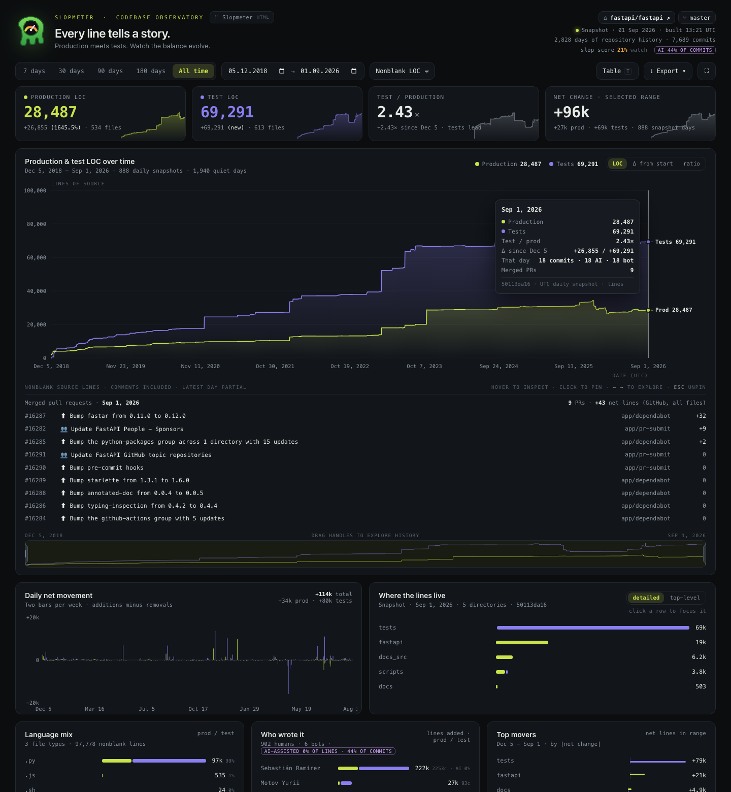

# slopmeter

Quantify AI slop in a git repository and render a self-contained, fullscreen
"codebase observatory" dashboard: exact production vs. test LOC over time,
daily movement, where the lines live, who wrote them, and a slop score.



*`slopmeter fastapi/fastapi` — 888 daily snapshots, a pinned day listing the
pull requests merged that day, and the test line (violet) pulling ahead of
production (lime).*

## Origin

I took this idea from **Peter Steinberger** ([@steipete](https://x.com/steipete)).
On 6 September 2026 he posted
[*"Built a slopmeter into our team server. You clearly see where we started
pushing for more tests."*](https://x.com/steipete/status/2096443715976089814)
together with a screenshot of the prompt he gave his OpenClaw agent:

> Create a dashboard with widgets to show how prod LOC and test LOC developed
> over time with a fancy interactive chart with a date duration selector,
> defaulting to last 30 days. Call it "Slopmeter" and draw a cool icon and pin
> it and make dashboard fullscreen.

The resulting page for `openclaw/openclaw` — "Every line tells a story.
Production meets tests. Watch the balance evolve." — showed millions of lines
and a test curve overtaking production. That looked like a genuinely useful
lens on any repo, so this is an independent, stdlib-only re-implementation you
can point at your own repositories: same layout and spirit, plus exact
per-day counting, deploy environments, a multi-repo fleet view, PR linkage and
AI-assisted commit detection. All credit for the idea, name and design goes to
Peter; the code here is mine.

The **slop score** borrows the *attention-gap* idea from
[slop-o-meter](https://slop-o-meter.dev): code is slop when it arrives faster
than humans can own, review and verify it.

Slop = code added faster than a human could meaningfully own, review, and
verify it. Point it at a repo and watch the balance between production and
test code evolve day by day.

## Develop

```bash
python -m pytest tests -q
```

## Install

No dependencies — stdlib only, Python ≥ 3.9.

```bash
pip install -e .
# or run directly:
python -m slopmeter /path/to/repo
```

## Usage

```bash
slopmeter /path/to/repo            # write slopmeter-<repo>.html
slopmeter . -o report.html -w      # custom output, open in browser
slopmeter . -d 90                  # default range 90 days (default: 30)
slopmeter . -b prod=main -b dev=develop   # explicit env → branch mapping
slopmeter . --group-depth 2        # finer directory breakdown

# several repos in one dashboard (repo switcher top-right, [ ] keys)
slopmeter ~/dev/api ~/dev/web -o team.html

# straight from GitHub: cloned once into ~/.cache/slopmeter/repos (no checkout,
# full history + tags), --refresh fetches next time
slopmeter acme/api acme/web --refresh

# every non-archived, non-fork repo of an org (needs `gh` authenticated)
slopmeter --org acme --only '^acme/(api|svc)-' -o acme.html
```

Remote specs accept `owner/repo`, `https://github.com/...` or `git@github.com:...`.
Set `SLOPMETER_CACHE` or `--cache` to move the clone cache.

Shallow clones only show the truncated history — run `git fetch --unshallow`
first for the full story (the CLI warns you).

## Environments

- **Branch-based** repos: `main`/`master` → prod, `develop`/`dev` → dev, `staging`.
- **Trunk-based** repos (deploy by tag): the trunk becomes `dev` (every push
  deploys) and tag families like `stg-*`, `prd-*`, `release-*` each become an
  environment. One snapshot per deploy, movement = everything merged between
  consecutive deploys, deploy markers (▲) appear on the other envs' charts —
  click one to jump there.
- Override with `-b ENV=BRANCH` / `-b ENV=tag:PREFIX`.

## How it counts

- **One snapshot per UTC day**: the last first-parent commit on the branch that
  day. The full tree is listed and every file classified as **production**
  (source code: `.go .py .ts .sql .sh .tf …`), **test** (`tests/` dirs,
  `_test.go`, `test_*.py`, `.spec`/`.test`, `.feature`, mocks & fixtures) or
  **ignored** (docs, config, JSON/YAML, lockfiles, vendored, generated).
- **Exact line counts** come from the blobs themselves via one
  `git cat-file --batch` stream; each unique blob is counted once, so a
  7-month repo renders in a couple of seconds. Nonblank = whitespace-only lines
  dropped, comments kept. All-lines, file and byte counts are also recorded.
- **Daily movement** uses `git log --numstat --first-parent`, so a merged PR
  lands as one day's change (additions and removals per class, per author,
  per directory).
- **Slop score** is the attention-gap model: weighted lines added vs. the human
  attention available (commit budget + test lines written). Lower is better.
  Tunables live at the top of `slopmeter/scoring.py` and `slopmeter/gitlog.py`.

## Fleet view, PRs, AI share

- With several repos the dashboard lands on a **Fleet** table (key `G`): LOC,
  test ratio, 30/90-day deltas, slop, AI share, last activity, sparkline —
  sortable, click a row to drill in.
- Merged **pull requests** are fetched with `gh` (`--no-prs` to skip). Pin a day
  to list what was merged; on tag environments a deploy lists everything merged
  since the previous deploy.
- **AI-assisted** commits are detected from `Co-Authored-By` trailers and
  Claude Code / Codex / Copilot markers in commit bodies, not just bot authors.
  AI-assisted human commits earn half the review attention in the slop score.
- The slop score shows `n/a` when history is too thin to mean anything.
- Per-repo classification overrides: drop a `.slopmeter.json` in the repo root
  with `ignore` / `test` / `prod` / `generated` glob lists.

See `IMPROVEMENTS.md` for the full list of what was reviewed, done and still open.

## The dashboard

Single HTML file, no external assets, mascot icon embedded as favicon (pin the
tab). Layout mirrors a codebase observatory:

- **Range**: 7 / 30 / 90 / 180 days / all time (keys `1`–`5`), free date
  pickers, and a **brush** under the main chart to drag through history.
- **Metric**: nonblank LOC, all lines, files, bytes.
- **KPI cards** with sparklines: production, tests, test/prod ratio, net change
  in range.
- **Main chart**: LOC · Δ from start · ratio modes, crosshair + tooltip,
  **click to pin**, `←`/`→` to step days (`shift` skips quiet days), `esc` to
  unpin, direct end labels, snapshot sha per day.
- **Daily net movement**: two bars per day (weekly beyond 120 days), additions
  minus removals, with the range total.
- **Where the lines live**: prod/test per directory (detailed or rolled up to
  top level). **Click a row to focus** every widget on that directory.
- **Language mix**, **Who wrote it** (humans vs. bots, lines/commit),
  **Top movers** (directories by net change in range).
- **Table view** (`T`), **Export** (CSV of the visible range, full JSON, main
  chart as SVG, copy link), **fullscreen** (`F`).
- Every view state lives in the URL hash, so links reproduce exactly what you see.
